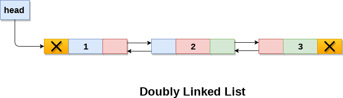

# Doubly `LinkedList` implementation



```python
from LinkedList import LinkedList


linkedlist = LinkedList()
start_data = [1, 2, 3, 4, 5]
end_data = [6, 7, 8, 9, 10]

for i in start_data[::-1]:
    linkedlist.prepend(i)

for i in end_data:
    linkedlist.append(i)

print(linkedlist)

>>> <LinkedList([1, 2, 3, 4, 5, 6, 7, 8, 9, 10])>

```

### <span style="color:#dc3545">! First, create head nodes using the `prepend` method.</span>.


inspired by [M2skills](https://github.com/M2skills/Linked-List-in-Python)